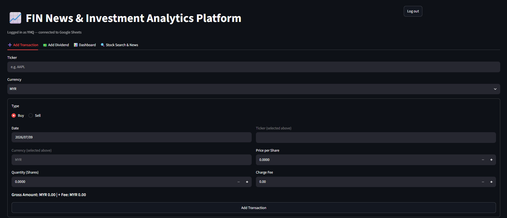
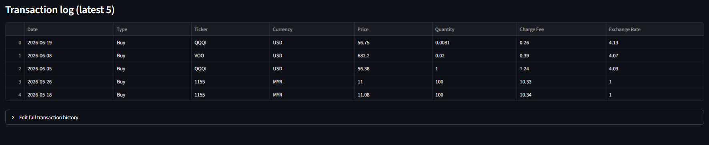
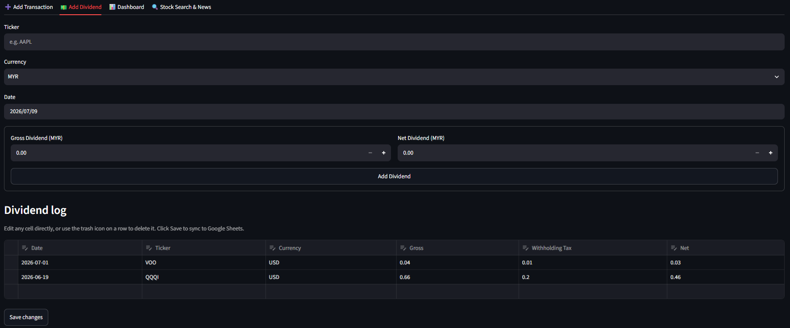
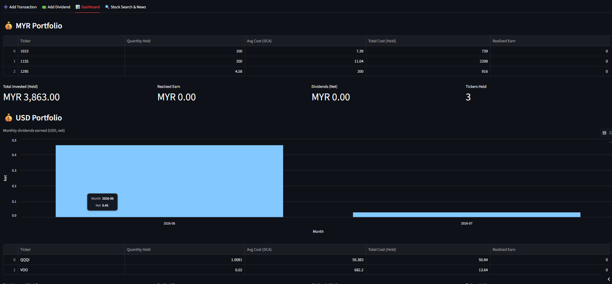
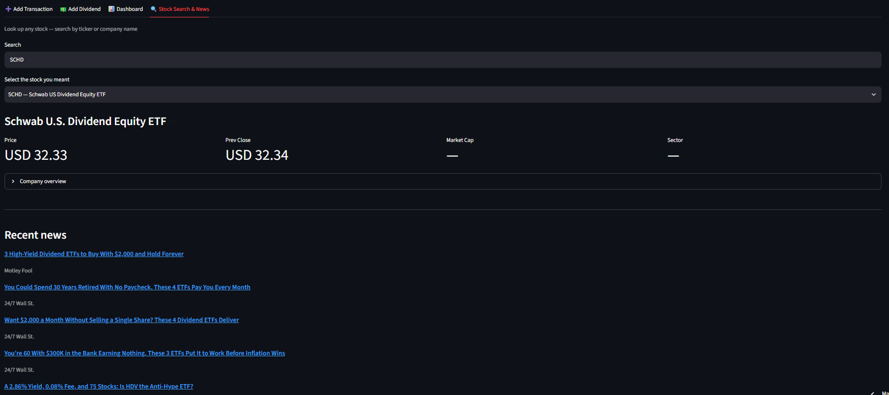

# FIN News & Investment Analytics Platform
## Overview
A web-based stock news and portfolio management application is to record stock transactions, monitor portfolio performance, manage dividend income and explore stock or company information with the latest market news.

## Features
**Transaction Management 💹**  
- Record Buy and Sell transactions
- Store transaction details such as currency, charge fees and exchanges rates
- Edit or delete historical transactions
- Automatic synchronization with Google Sheets

**Dividend Tracking 💵**  
- Record gross and net dividends
- Automatically compute withholding tax
- Edit or delete dividend records

**Portfolio Dashboard 📊**
- Portfolio summary by currency
- Automatic compute average cost, total invested capital and profit/loss
- Monthly dividend dashboard

**Stock Search & News 🔍**  
- Search by ticker or company name
- Display company profile
- View current market price and previous closing price
- Display market capitalization
- Browse latest company news powered by Yahoo Finance

## Tech & Tools
1. Python
2. Streamlit
3. Google Service Account - Google Sheets API
4. Pandas
5. Yahoo Finance

## Screenshots

## Purpose  
This project was created as a learning project to explore how to build an interactive web application using Streamlit. The main objectives were:

- To learn how to store and manage application data using Google Sheets as a lightweight database.
- To understand how Streamlit can be used to build interactive dashboards and user interfaces.
- To practice integrating external data sources to track the latest financial news from reliable sources.
- To improve skills in Python, data processing, and application deployment.
